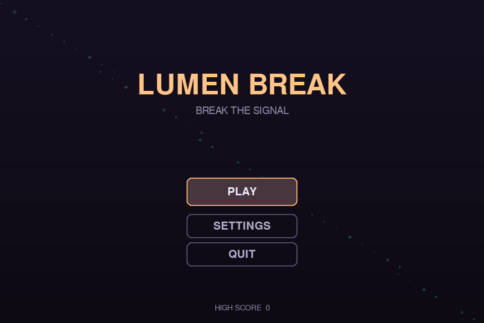
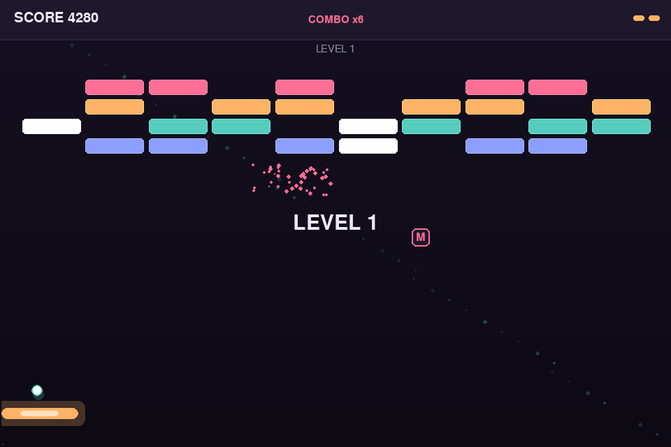
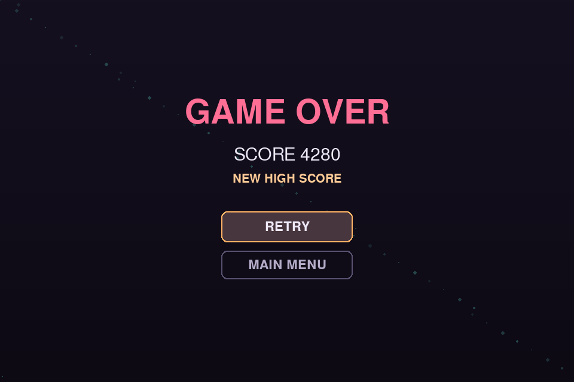

# Lumen Break

A breakout-style arcade game built in Python, designed as much around its **UI/UX** as its
gameplay: an animated menu, a hand-built widget toolkit (buttons, sliders, toggles),
smooth screen transitions, particle bursts, combo feedback, and trauma-based screen
shake — all with a deliberate visual identity instead of a default "neon-on-black" look.



## Features

- **Custom UI toolkit** — buttons with hover-lift/press-squash animation, a draggable
  slider, an animated toggle switch, and cross-fade screen transitions, all built from
  scratch on top of raw Pygame drawing primitives (`src/ui.py`).
- **Game feel** — particle bursts on brick destruction, a ball trail, combo streaks with
  score multipliers, and trauma-based screen shake that scales with a user-controlled
  "Effects Intensity" setting.
- **Real gameplay systems** — multi-hit bricks, three power-ups (widen paddle, slow ball,
  multiball), progressive levels, lives, and a persisted high score (JSON, no DB needed).
- **A considered visual identity** — a warm/cool duotone (amber + teal + rose) on a deep
  plum background, chosen to avoid the generic "single accent on pure black" look that
  most quick game prototypes default to.
- **Clean architecture** — screens, entities, UI widgets, and persistence are separated
  into small modules so the project reads well and is easy to extend.

<p align="center">
  
  
</p>

## Getting started

```bash
git clone https://github.com/<your-username>/lumen-break.git
cd lumen-break
pip install -r requirements.txt
python main.py
```

Requires Python 3.9+ and Pygame 2.5+.

## Controls

| Action              | Input                          |
|---------------------|---------------------------------|
| Move paddle          | Mouse, or `←`/`→` (`A`/`D`)     |
| Launch ball          | `Space`, `↑`, or click           |
| Pause                | `Esc`                            |

## Project structure

```
lumen-break/
├── main.py                # entry point
├── src/
│   ├── app.py              # App shell: window, screen manager, main loop, screen shake
│   ├── constants.py        # design tokens: palette, type scale, layout
│   ├── ui.py                # Button, Slider, Toggle, FadeTransition, easing helpers
│   ├── entities.py          # Paddle, Ball, Brick, Particle, PowerUp, level generation
│   ├── screens.py            # MenuScreen, SettingsScreen, PlayScreen, PauseOverlay, GameOverScreen
│   └── state.py               # JSON-backed save data (high score, settings)
├── docs/screenshots/          # images used in this README
└── smoke_test.py               # headless test that exercises every screen and mechanic
```

Each screen owns its own widgets and only talks to the rest of the app through a small
`app` interface (`app.go_menu()`, `app.go_play()`, `app.save`, `app.shaker`), so screens
can be read and modified independently.

## Design notes

The palette is defined once as design tokens in `src/constants.py` rather than scattered
through the drawing code:

| Token | Hex | Role |
|---|---|---|
| `BG_TOP` / `BG_BOTTOM` | `#151020` → `#0D0A14` | background gradient |
| `AMBER` | `#FFB366` | primary accent — player, primary actions |
| `TEAL` | `#56CCBF` | secondary accent — bricks, ball, secondary UI |
| `ROSE` | `#FF6E94` | tertiary accent — danger, combo highlight |

Every widget animates toward a target state each frame (`value += (target - value) * rate`)
rather than snapping, which is what gives the hover/press/toggle interactions their
smoothness without needing a tweening library.

## Testing

```bash
python smoke_test.py
```

Runs headlessly (no window needed) and walks through every screen transition, a full
level clear, a game-over, pause/restart, and a power-up pickup — useful as a quick
regression check after changes.

## License

MIT — see [LICENSE](LICENSE).
